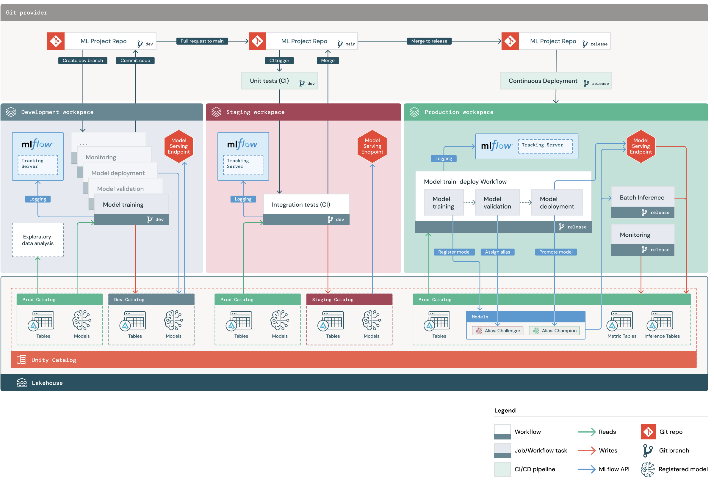

# my_mlops_stacks

This directory contains an ML project based on the default
[Databricks MLOps Stacks](https://github.com/databricks/mlops-stacks),
defining a production-grade ML pipeline for automated retraining and batch inference of an ML model on tabular data.
The "Getting Started" docs can be found at https://learn.microsoft.com/azure/databricks/dev-tools/bundles/mlops-stacks.

See the full pipeline structure below. The [MLOps Stacks README](https://github.com/databricks/mlops-stacks/blob/main/Pipeline.md)
contains additional details on how ML pipelines are tested and deployed across each of the dev, staging, prod environments below.




## Code structure
This project contains the following components:

| Component                  | Description                                                                                                                                                                                                                                                                                                                                             |
|----------------------------|---------------------------------------------------------------------------------------------------------------------------------------------------------------------------------------------------------------------------------------------------------------------------------------------------------------------------------------------------------|
| ML Code                    | Example ML project code, with unit tested Python modules and notebooks                                                                                                                                                                                                                                                                             |
| ML Resources as Code | ML pipeline resources (training and batch inference jobs with schedules, etc) configured and deployed through [databricks CLI bundles](https://learn.microsoft.com/azure/databricks/dev-tools/cli/bundle-cli)                                                                                              |
| CI/CD                      | [Azure DevOps Pipelines](https://azure.microsoft.com/en-gb/products/devops/pipelines/) to test and deploy ML code and resources      |

contained in the following files:

```
my_mlops_stacks        <- Root directory. Both monorepo and polyrepo are supported.
│
├── my_mlops_stacks       <- Contains python code, notebooks and ML resources related to one ML project. 
│   │
│   ├── requirements.txt        <- Specifies Python dependencies for ML code (for example: model training, batch inference).
│   │
│   ├── databricks.yml          <- databricks.yml is the root bundle file for the ML project that can be loaded by databricks CLI bundles. It defines the bundle name, workspace URL and resource config component to be included.
│   │
│   ├── training                <- Training folder contains Notebook that trains and registers the model with feature store support.
│   │
│   ├── feature_engineering     <- Feature computation code (Python modules) that implements the feature transforms.
│   │                              The output of these transforms get persisted as Feature Store tables. Most development
│   │                              work happens here.
│   │
│   ├── validation              <- Optional model validation step before deploying a model.
│   │
│   ├── monitoring              <- Model monitoring, feature monitoring, etc.
│   │
│   ├── deployment              <- Deployment and Batch inference workflows
│   │   │
│   │   ├── batch_inference     <- Batch inference code that will run as part of scheduled workflow.
│   │   │
│   │   ├── model_deployment    <- As part of CD workflow, deploy the registered model by assigning it the appropriate alias.
│   │
│   │
│   ├── tests                   <- Unit tests for the ML project, including the modules under `features`.
│   │
│   ├── resources               <- ML resource (ML jobs, MLflow models) config definitions expressed as code, across dev/staging/prod/test.
│       │
│       ├── model-workflow-resource.yml                <- ML resource config definition for model training, validation, deployment workflow
│       │
│       ├── batch-inference-workflow-resource.yml      <- ML resource config definition for batch inference workflow
│       │
│       ├── feature-engineering-workflow-resource.yml  <- ML resource config definition for feature engineering workflow
│       │
│       ├── ml-artifacts-resource.yml                  <- ML resource config definition for model and experiment
│       │
│       ├── monitoring-workflow-resource.yml           <- ML resource config definition for data monitoring workflow
│
├── .azure                      <- Configuration folder for CI/CD using Azure DevOps Pipelines.  The CI/CD workflows deploy ML resources defined in the `./resources/*` folder with databricks CLI bundles.
│
├── docs                        <- Contains documentation for the repo.
│
├── cicd.tar.gz                 <- Contains CI/CD bundle that should be deployed by deploy-cicd.yml to set up CI/CD for projects.
```
